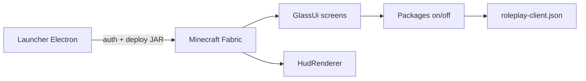

# Roleplay Client — Project Primer

## Scopo

Roleplay Client è un client Minecraft personalizzato composto da:

1. **Launcher Electron** — account Microsoft/offline, profili, mod, avvio del gioco
2. **Mod Fabric client-side** (`roleplay-client`) — HUD, moduli RP, GUI Liquid Glass allineata al launcher

Target: Minecraft **1.21.8**, Java **21**, Fabric Loader.

## Stack

| Parte | Tecnologie |
|-------|------------|
| Launcher | Electron 28, Node.js 18+, `minecraft-launcher-core`, `msmc` |
| Mod | Fabric Loom, Yarn mappings, Fabric API, Java 21 |
| UI launcher | HTML/CSS in `public/index.html` (Liquid Glass × Material 3), Montserrat |
| UI in-game | `GlassUi` + screen custom (stessi token colore del launcher) |

## Struttura

```text
LoloClient/
├── src/                    # Electron main + preload
│   ├── main.js
│   └── preload.js
├── public/                 # UI launcher
│   ├── index.html          # FONTE DI VERITÀ stilistica
│   ├── renderer.js
│   ├── avatar.js
│   └── fonts/
├── loloclient-mod/         # Mod Fabric
│   └── src/main/java/net/roleplayclient/
│       ├── RoleplayClientMod.java
│       ├── RoleplayConfig.java
│       ├── Packages.java
│       ├── gui/            # GlassUi, GlassButton, Icons, WindowIcons
│       ├── hud/HudRenderer.java
│       ├── screen/         # ModMenu, liste RP, Title/Pause/Options RC
│       └── mixin/
├── assets/mods/            # JAR deployato dal launcher
├── lib/fabric-installer.js
├── docs/
│   ├── PROJECT_PRIMER.md   # questo file
│   └── developer-guide.md
├── AGENTS.md
└── package.json
```

## Flusso principale



1. L’utente avvia il launcher (`npm start`).
2. Il launcher autentica (Microsoft o offline) e copia `roleplayclient.jar` in `assets/mods` / cartella istanza.
3. Minecraft parte con Fabric; la mod registra keybind, HUD, mixin e sostituisce Title/Pause/Options.
4. Da Controlli → **Roleplay Client Mods** (o dal Title RC) si gestiscono i pacchetti.
5. Il **profilo attivo** del launcher è l’`instanceId` (mods, saves, launch path).

## Configurazione

### Launcher

Persistenza in AppData (cifratura `safeStorage` quando disponibile). Campi sensibili: token account. Non loggare mai i token. `save-config` accetta solo campi whitelist (settings/accounts/profiles/last*).

### Mod

File: `config/roleplay-client.json`

- `modules` — on/off pacchetti
- `positions` — posizioni HUD normalizzate 0..1
- `faces`, `quickMessages`, `waypoints`, `alarms`

Salvataggio a ogni modifica. Scrivere in modo atomico (temp + rename) quando possibile.

## Design system (parity launcher)

Fonte: `public/index.html` (`:root` dark).

| Token | Hex / uso |
|-------|-----------|
| accent | `#FCAD14` / `#F09300` |
| on-accent | `#3A2400` |
| blue | `#3D8CFF` / `#247CE2` |
| bg | `#050A16` |
| glass | rgba(14,24,46,…) |
| testo | `#F6F3EE` / muted |

In-game: `GlassUi`, `GlassButton`, toggle Material 52×30. **Mai** `setFilter(..., true)` (mipmap) sulle texture UI — causa cubi bianchi agli angoli 9-slice. Aurora: posizioni aggiornate ~20fps (throttle), non ogni frame.

## Pacchetti (Packages)

Definiti in `Packages.java` (HUD + RP). Aggiunta:

1. Record in `Packages`
2. Posizione default in `RoleplayConfig` se HUD
3. Logica in `HudRenderer` o manager dedicato

## GUI in-game

| Screen | Ruolo |
|--------|-------|
| `RcTitleScreen` | Menu principale |
| `RcPauseScreen` | Pausa |
| `RcOptionsScreen` | Hub opzioni |
| `ModMenuScreen` | Moduli RC |
| Liste RP | Faces, QuickMessages, Waypoints, Alarms |
| `HudEditorScreen` | Drag posizioni HUD |

Mixin `MinecraftClientMixin` sostituisce Title/GameMenu/Options vanilla. `ScreenMixin` applica aurora GlassUi ai sotto-menu. Screen RP in-world: `shouldPause() = true`.

Icona finestra OS: logo RC minimale via `WindowIcons` (GLFW).

## Build

```powershell
# Launcher
npm install
npm start

# Mod
cd loloclient-mod
gradle build
# JAR: build/libs/roleplayclient-*.jar → copiato in assets/mods dal launcher
```

## Estensione rapida

- Nuovo HUD: vedi `docs/developer-guide.md`
- Nuova screen RC: estendi `Screen`, usa `GlassUi.background` + `GlassButton`, `shouldPause()=true` se aperta in-world
- Nuovo colore chip: usalo pure — `GlassUi.chip` genera lazy la texture

## Bug noti / sicurezza (catalogo aggiornato)

Stato post P1→P5. **FIXED** = sistemato; **OPEN** = residuo.

### Già sistemato (FIXED)

- Cubi/rettangoli bianchi GlassUi (mipmap + fallback disc/chip)
- Mod Menu riscritto + toggle Material usabili
- Token launcher: log ridotti, `open-external` schema http(s), toast XSS con `textContent`
- IPC FS ristretto (`fsAllowedRoots`), `safeInstanceId`, `delete-mod` con `basename` + jar protetti
- Write atomico config launcher + mod; `lib/**` in electron-builder
- Promise launch Fabric risolta allo spawn; classpath `path.delimiter`
- QuickMessages null-check `networkHandler`; ModManager `Files.list` chiuso; cache testo HUD
- Icona finestra MC; Title/Pause/Options RC; volti rispettano `isEnabled` (keybind + `onChat`)
- **P1** Restart Fabric (preload/renderer) + profili UI ↔ istanze FS
- **P2** Refresh MS al play; zero log `mcToken`; `esc()` innerHTML; schema `save-config`; `validatePath`+realpath
- **P3** PackScreen → `RcOptionsScreen`; `shouldPause` screen RP; null-safety `RcPauseScreen`; Options Done non torna al sotto-menu
- **P4** Settings cablate (`closeOnLaunch`, `optimizeFps`, `openLogsOnLaunch`); stats Home reali; no toggle snapshots fantasma
- **P5** Aurora throttle; glow toggle leggero; `fabricLoaderOverride` + libs Fabric; preferenza Java 21; Cinema HUD reset

### 1. Bug (STILL OPEN)

| Sev | Problema | Dove |
|-----|----------|------|
| Medio | Vanilla launch: Promise ancora su `close` (`isFabric===false`) | `main.js` |
| Medio | Natives / `java.library.path` senza estrazione dedicata | `main.js` |
| Medio | Pause/Opzioni/Title incompleti vs vanilla (LAN, Telemetry, copyright…) | screen RC |
| Basso | `requestRestart()` mod non collegato a flusso UI reale | `RoleplayClientMod` |

### 2. Sicurezza (STILL OPEN)

| Sev | Rischio | Dove |
|-----|---------|------|
| Alto | Token ancora decifrati in memoria renderer via `get-config` | main / renderer |
| Medio | `sandbox: false` sulla BrowserWindow | `main.js` |
| Medio | Fallback crypto Base64 se `safeStorage` assente | `main.js` |
| Medio | Fabric installer con `shell: true` su Windows | `fabric-installer.js` |
| Basso | `open-external` senza allowlist host; download senza cap | main / installer |
| Basso | Scene log illimitato; quick `/comando` via hotkey (by design RP) | mod |
| Info | `--accessToken` in CLI Java (inerente a MC) | launch |

### 3. Performance / lag (STILL OPEN)

| Sev | Problema | Dove |
|-----|----------|------|
| Medio | `ensureDefaultPack` / scan asset a ogni launch; AdmZip su listing mods | `main.js` |
| Medio | Walk ricorsivo libraries per classpath (duplicato) | `main.js` |
| Basso | `save()` sync a ogni toggle; CDS dump; `disableHardwareAcceleration`; skin cache RAM | launcher / mod |

### 4. UX / QoL (STILL OPEN)

| Sev | Problema | Dove |
|-----|----------|------|
| Medio | Progress Fabric senza `launch-progress` dettagliato; versioni MC/Fabric hardcoded | launcher |
| Medio | GlassButton senza Tab/narration; alcune liste con `ButtonWidget` vanilla | mod GUI |
| Basso | Stringhe UI RC hardcoded IT; hotkey quick accidentali `/` | mod |

### 5. Qualità / manutenibilità (STILL OPEN)

| Sev | Problema | Dove |
|-----|----------|------|
| Medio | `main.js` monolitico; `APP_DATA_PATH` hardcodato Windows; `adm-zip` transitivo | launcher |
| Medio | Nessun `gradlew`; zero test automatizzati mod; `ModManager` dead code | progetto |
| Basso | `ScreenMixin` filtra per nome classe; CSP `unsafe-inline` | mixin / HTML |

## Convenzioni

- Java package `net.roleplayclient`, errori con `System.err.println`
- JS: `main.js` / `renderer.js` / `preload.js`, errori con `console.error`
- UI: sempre token launcher; niente palette purple-default AI
- Non committare secret / token
- Profilo attivo = `instanceId` per mods e launch
